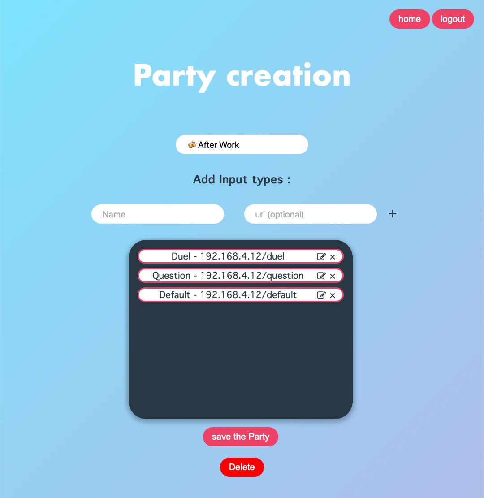

# partyfy
The UBER of collaborative party game

# Introduction
This project is a collaborative game. 

The goal of this game is to make evenings with friends more fun.

Invite your friends and let them create there own inputs (private jokes alowed). 

When you have enough inputs (you can create them before the real party) you can PLAY.
Select you party, your players and start. 

It will play by itself (no game master needed). Your browser can read the inputs (if supported). And the participants will be automatically generated. 

You can optionnaly add smart lighting to the game. The lightings are synced to the input types. The types represent what ever you want.
For example a type could be "Quizz" the light would alert everyone that a quizz is comming and then the voice will read the input. 

The possiblilities are quite wide so explore them and have fun. 


Sorry for the french content. We play with french people so it's easier.


# Website strucutre

## Login page
Here you can login or create an account. It's also the official way to change your password using the "forgot password" link. 


## Home
This is the homepage, you can select parties you've created (to modify settings or to share it). You can also add inputs to parties your invited in. Pretty simple.

The share button will give you a link that will allow you to join a party to add inputs in it.

The play button will redirect you to the game-engine page. Note that you can't play a partie you've not created (Only the admin can have acces to every inputs for surprises reasons).


## Party Creation
Use this page to create a new Party! You can also add input types. Input types are used to define what is the theme of the input. It's used in the game engine to add context. You can also add an url for smart lighting integrations.  


## Input creation
If you've been invited to a Party (or your the Party creator) you can add inputs! 
You have to define a Title, a type (theme), if you want to include players names use the anchor in the text field.

You can use the speaker button to see it the voice match what you want.


## Game Engine
Wenn you're ready to play, select a party, blacklist players and inputs if needed. You can allow the auto text to speech and the time between inputs. You can also allow smart interaction (based on the link of the input types). 

When the party begins it will play automatically. 

### Settings


### Game


# To do
- Test the game engine
- The Smart lighting feature

# Usage
```
git clone https://github.com/Fienberber/partyfy
cd partyfy
```
Optional: Create a venv
```
python3 -m venv venv
source venv/bin/activate
```
Install requirements and start the server
```
pip install -r requirements.txt
python3 main.py
```
Now access http://127.0.0.1:8000


You have to create a `smtp_setup.py` file to enable the "change password" feature.

This is the content required:
``` python
smtp_server = "mail.domain.net"
port = 465 
sender_email = "sender_email@domain"
password = "*********"

```

For the secret part, you will need a `secret.py` file:
```python
SECRET_KEY = b'*******************'
```


